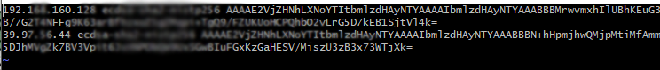
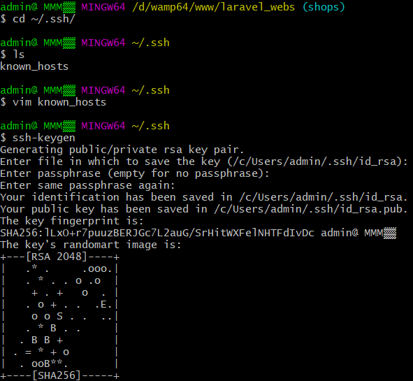
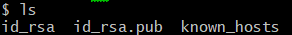
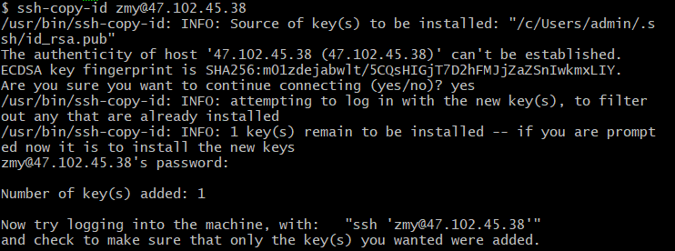
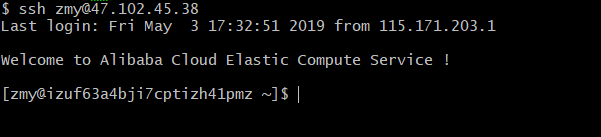

## 服务器如何不输密码免密登录

首先进入当前用户 `.ssh` 下的文件夹中

> cd ~/.ssh/

可以先看一下当前文件夹下面的文件    

未设置公私钥之前只有一个文件 查看一下里面的内容（这里面是记录在本机本用户登录过得服务器）

接下来在本地生成一个公私

> ssh-keygen

正常情况下这样在本地公私钥已经生成了

接着看一下当前文件夹下的文件

第一个 `id_rsa` 公钥，`rsa` 是加密方式

第二个 `id.rsa_pub` 就是生成的公钥

接来下就是将本地的公钥加入到服务器的可免密公钥文件：
> vim ~/.ssh/authorized_keys

有两种方式
第一种：

>在当前机器生成公钥和私钥 `ssh-keygen` 
> 根据提示生成以后，会在 `/.ssh/` 目录下生成相关的文件。这里的指的是用户的目录，比如，在 `linux` 下 `abc` 用户的目录为` /home/abc` ，`root` 用户的目录为 `/root` ，在 `mac` 下是在`/Users/<用户名>`
> 将公钥 `id_rsa.pub` 拷贝到目标机器上 scp ~/.ssh/id_rsa.pub zmy@47.102.45.38:~/ 这行命令将当前用户的公钥拷贝到远程机器的 `root` 用户目录下 
> ssh zmy@47.102.45.38 
> cat id_rsa.pub >> ~/.ssh/authorized_keys #加入信任列表 
> rm id_rsa.pub #删除公钥 
> exit #退出远程机器 这时已经返回到当前机器，再执行 `ssh` zmy@47.102.45.38就不再需要输入密码了

第二种：

> ssh-copy-id root@192.168.1.10 把当前的本地的公钥直接加入到服务器的可免密公钥文件 `~/.ssh/authorized_keys` 中

自己使用的是第二种

这样就完成了将本地公钥放到服务器的可免密公钥文件里面

然后试一下

大公搞成！

[个人 `Github` 欢迎关注](https://github.com/zhumengyangi)